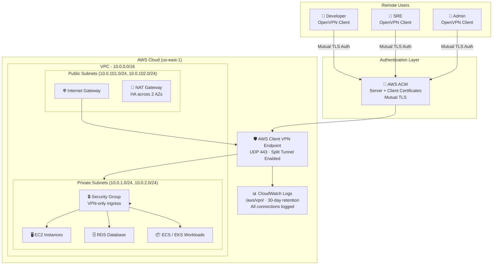

# aws-secure-remote-access


> AWS Client VPN + Zero Trust Network Access (ZTNA) architecture  -  Terraform-automated, certificate-authenticated, and built for distributed teams who can't afford a breach.

---

## The Problem

Most remote access setups make one of two mistakes:

1. **Too open:** A single VPN credential grants full network access. One compromised account = full lateral movement across your infrastructure.
2. **Too manual:** Teams cobble together SSH tunnels, bastion hosts, and port-forwarding rules that nobody documents and nobody fully understands.

Neither is acceptable for a production environment.

This project solves both. It delivers a **secure, auditable, certificate-authenticated remote access layer** on AWS, with split tunneling, per-resource authorization, and CloudWatch connection logging  -  all provisioned in minutes via Terraform.

---

## Architecture



### Traffic Flow

```
Remote User
    │
    ▼  [UDP 443  -  Mutual TLS / Certificate Auth]
AWS Client VPN Endpoint
    │
    ▼  [Authorisation Rules checked per CIDR]
Private Subnet (No public IPs  -  unreachable without VPN)
    │
    ├──▶ EC2 Instances      [SG: port 22 from VPN SG only]
    ├──▶ RDS Databases      [SG: port 5432/3306 from VPN SG only]
    └──▶ ECS/EKS Services   [SG: port 443/8080 from VPN SG only]

All connection events ──▶ CloudWatch Logs
```

---

## Zero Trust Design Principles Applied

| Principle | Implementation |
|---|---|
| **Verify explicitly** | Mutual TLS  -  both client and server present certificates |
| **Least privilege access** | Authorization rules scoped per CIDR, not full VPC |
| **Never trust the network** | Private resources have no public IPs  -  VPN is the only path in |
| **Assume breach** | All connections logged to CloudWatch with user identity and timestamp |
| **Limit blast radius** | Security groups allow only specific ports from the VPN security group |
| **Split tunneling** | Only AWS-bound traffic routes through VPN  -  no unnecessary exposure |

---

## Features

- **Certificate-based mutual TLS**  -  no passwords, no shared secrets
- **Split tunneling**  -  only traffic destined for your VPC routes through the VPN
- **Per-resource authorization rules**  -  scope access per subnet or CIDR
- **CloudWatch connection logging**  -  full audit trail of every connection
- **Multi-AZ NAT gateways**  -  high availability for outbound traffic
- **Security groups with VPN-only ingress**  -  your resources are unreachable without the VPN
- **Fully parameterised Terraform**  -  deploy to any region or CIDR range with variable overrides
- **Default tags on all resources**  -  consistent tagging across every AWS resource

---

## Repository Structure

```
aws-secure-remote-access/
├── terraform/
│   ├── main.tf               # Provider config and Terraform backend
│   ├── vpc.tf                # VPC, subnets, IGW, NAT, route tables
│   ├── vpn.tf                # Client VPN endpoint, associations, routes
│   ├── acm.tf                # ACM certificate imports (server + client)
│   ├── security_groups.tf    # VPN endpoint SG + internal resources SG
│   ├── iam.tf                # IAM role and policy for CloudWatch logging
│   ├── variables.tf          # All input variables with descriptions
│   ├── outputs.tf            # VPN endpoint DNS, VPC ID, subnet IDs
│   └── terraform.tfvars.example  # Example variable values
├── scripts/
│   └── generate-certs.sh     # easy-rsa script to generate server + client certs
├── docs/
│   ├── zero-trust-guide.md   # Deep-dive on ZTNA principles applied here
│   └── client-setup.md       # End-user guide to connect via OpenVPN
├── certs/                    # ⚠️ Gitignored  -  generated locally, never committed
└── README.md
```

---

## Prerequisites

| Tool | Version | Purpose |
|---|---|---|
| [Terraform](https://developer.hashicorp.com/terraform/downloads) | ≥ 1.5.0 | Infrastructure provisioning |
| [AWS CLI](https://aws.amazon.com/cli/) | ≥ 2.x | AWS authentication |
| [easy-rsa](https://github.com/OpenVPN/easy-rsa) | 3.x | Certificate generation |
| [OpenVPN client](https://openvpn.net/vpn-client/) | Any | End-user VPN client |

**AWS Permissions required:**
`ec2:*`, `acm:*`, `logs:*`, `iam:CreateRole`, `iam:AttachRolePolicy`

---

## Quick Start

### Step 1  -  Generate Certificates

```bash
cd scripts
chmod +x generate-certs.sh
./generate-certs.sh
```

This creates `certs/` with your CA, server, and client certificates using easy-rsa.

### Step 2  -  Configure Variables

```bash
cd terraform
cp terraform.tfvars.example terraform.tfvars
# Edit terraform.tfvars with your values
```

### Step 3  -  Deploy

```bash
terraform init
terraform plan
terraform apply
```

Deployment takes approximately **10–15 minutes** (AWS Client VPN endpoints are slow to provision).

### Step 4  -  Download Client Config

```bash
# After apply, download the .ovpn config from the AWS console:
# EC2 → Client VPN Endpoints → [your endpoint] → Download Client Configuration

# Append your client certificate and key to the .ovpn file:
cat >> downloaded-config.ovpn <<EOF
<cert>
$(cat ../certs/client1.domain.tld.crt)
</cert>
<key>
$(cat ../certs/client1.domain.tld.key)
</key>
EOF
```

### Step 5  -  Connect

Import the `.ovpn` file into your OpenVPN client and connect. You now have secure, audited access to your private AWS resources.

---

## Configuration Reference

| Variable | Default | Description |
|---|---|---|
| `aws_region` | `us-east-1` | AWS region to deploy into |
| `project_name` | `secure-remote-access` | Name prefix for all resources |
| `environment` | `prod` | Environment tag applied to all resources |
| `vpc_cidr` | `10.0.0.0/16` | VPC CIDR block |
| `private_subnet_cidrs` | `["10.0.1.0/24", "10.0.2.0/24"]` | Private subnet CIDRs (one per AZ) |
| `public_subnet_cidrs` | `["10.0.101.0/24", "10.0.102.0/24"]` | Public subnet CIDRs (for NAT) |
| `availability_zones` | `["us-east-1a", "us-east-1b"]` | AZs to deploy subnets into |
| `vpn_client_cidr` | `10.100.0.0/16` | CIDR assigned to VPN clients  -  must not overlap VPC |
| `split_tunnel_enabled` | `true` | Route only AWS traffic through VPN |
| `dns_servers` | `["8.8.8.8", "8.8.4.4"]` | DNS servers pushed to VPN clients |

---

## Security Considerations

- **Never commit certificates.** The `certs/` directory is gitignored. Store client certificates in a secrets manager (AWS Secrets Manager, HashiCorp Vault) for team distribution.
- **Rotate certificates periodically.** Set a calendar reminder  -  ideally every 12 months or when team members leave.
- **Review CloudWatch logs regularly.** Unexpected connection times or unknown source IPs are early indicators of credential compromise.
- **Scope authorization rules tightly.** If a developer only needs access to one subnet, don't authorize the full VPC CIDR.
- **Use AWS Private CA for production.** For organisations with >10 users, AWS Private CA provides centralised certificate lifecycle management.

---

## Extending This Architecture

| Extension | How |
|---|---|
| Active Directory auth | Replace `certificate-authentication` with `directory-service-authentication` in `vpn.tf` |
| MFA enforcement | Integrate AWS IAM Identity Center with your directory service |
| Per-group authorization | Create multiple `aws_ec2_client_vpn_authorization_rule` resources with `access_group_id` |
| Remote state | Uncomment the S3 backend block in `main.tf` |
| Multi-region | Duplicate the module with a different `aws_region` variable |

---

## Cost Estimate

| Resource | Approximate Monthly Cost |
|---|---|
| Client VPN endpoint | ~$0.10/hr + $0.05 per connection-hour |
| NAT Gateway (×2) | ~$32/month + data transfer |
| CloudWatch Logs | ~$0.50/GB ingested |

> For a team of 5 with typical usage (~40 hrs/month each), expect **~$60–80/month** total.

---

## Contributing

1. Fork the repo
2. Create a feature branch: `git checkout -b feature/your-improvement`
3. Make your changes and test with `terraform validate` + `terraform plan`
4. Submit a pull request with a clear description of what changed and why

Issues and PRs welcome  -  especially for additional auth methods, multi-region patterns, or cost optimisations.

---

## License

MIT  -  see [LICENSE](LICENSE) for details.

---

## Author

**Ndohnwi Declan**  -  AWS Cloud & Cybersecurity Engineer

- GitHub: [@ndeclanx](https://github.com/ndeclanx)
- CompTIA Security+ | Google Cybersecurity Certified
- Available for consulting engagements in cloud security and infrastructure
